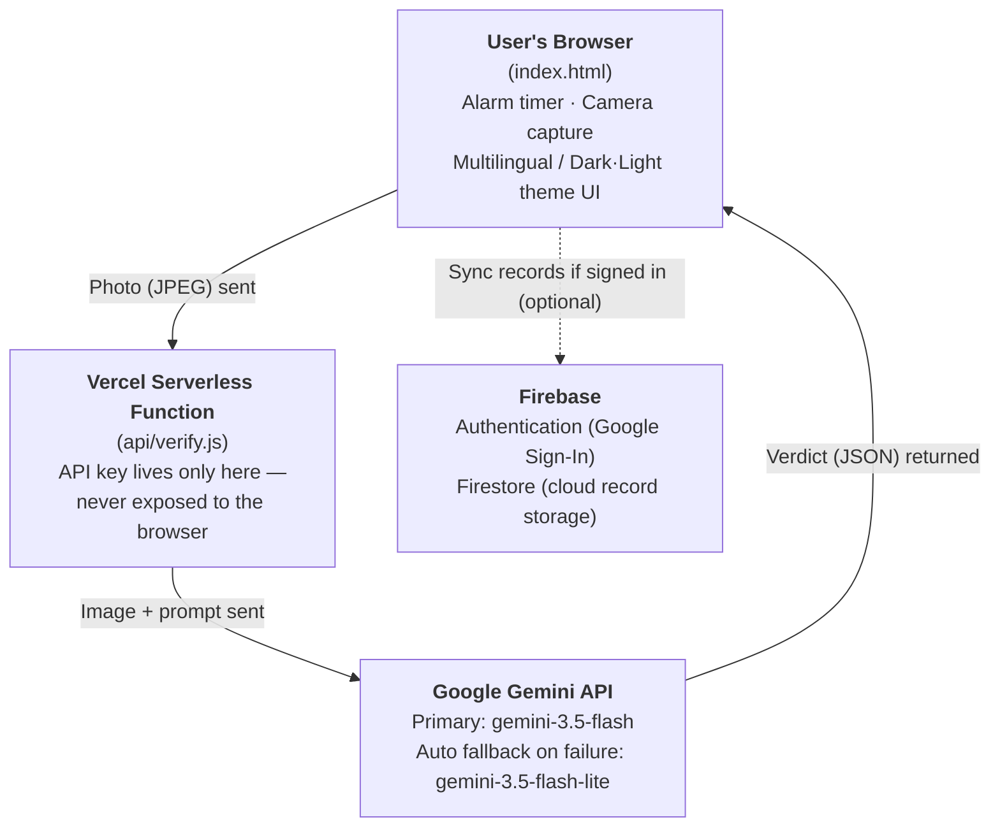

# 💧 Water-Cycle (Hydration Timer Project)

**🌐 Language**: [한국어](./README.md) · English (this document) · [日本語](./README.ja.md)


> Entry for the 4th NAVER OGQ Market AI Competition · Team **AI도 놀랄 팀 (Team AI-Surprise)**
> Category: ① IT · Software · Robotics

**🔗 Live Demo**: https://drink-water-five-drab.vercel.app/
**🎥 3-Minute Pitch Video**: https://youtu.be/ApWkJ1hUQ2w

---

## Overview

**Water-Cycle** is an attendance-linked health management project for environments — such as semiconductor cleanrooms and production sites — where staying hydrated is easy to neglect due to the nature of the work. At set intervals, it prompts workers to naturally step away and hydrate, then **verifies that hydration with AI**. Rather than a one-off campaign, it's designed as a repeatable routine woven into the worker's existing movement pattern, so that habit formation and verification happen together.

The name **Water-Cycle** reflects a repeating loop — alarm → move → drink → verify — and the idea that the habit compounds each time the cycle repeats.

## 1. Problem Definition

Semiconductor cleanrooms and similar production sites require wearing protective suits and passing through air showers, which raises the barrier to something as simple as drinking water far higher than in a typical office. During long stretches of focused work, thirst often goes unnoticed — and even when noticed, acting on it is inconvenient. The resulting chronic dehydration can lead to reduced concentration, fatigue buildup, and higher risk of safety incidents.

Conventional alarm apps or button-click checklists share a fundamental limitation: there's no way to confirm the gap between "the alarm was acknowledged" and "the person actually drank water." **Water-Cycle closes that gap with AI Vision.** An alarm goes off at a set time, and it is only dismissed once the user photographs themselves actually drinking water and the AI verifies it. The key differentiator is enforcing the habit through "behavior verification," not just a notification.

### Leveraging Existing Movement
By naturally folding hydration into the "leave the floor → locker room / break area" route workers already take, the app reduces the psychological resistance tied to "wasting extra time" and improves on-site acceptance.

## 2. Real-World Usage Scenario (Full Cycle)

```
① Alarm rings → ② Wrap up current task → ③ Air shower & exit → ④ Drink water at a water station → ⑤ AI verification in the app → (wait for next alarm, back to ①)
```

Steps **① and ⑤** (the alarm and AI-verified capture) are what the app currently implements; steps ②–④ are the physical movements workers carry out on-site.

## 3. Architecture

The browser (frontend) never has access to the AI API key. Captured photos are sent only to our own backend server, which calls the AI API using a key stored in an environment variable. AI verification is redundant: if the primary model doesn't respond, the same service automatically falls back to a secondary model. Record storage branches between browser storage and the cloud depending on whether the user is signed in.



- Captured photos are discarded immediately after verification; they are never stored on any server or database.
- **The app is fully usable without signing in.** In that case, today's verification records, stats, and settings are kept in browser storage and persist across page refreshes.
- **Signing in with a Google account** stores the same records in Firestore (cloud), so they persist even if the device or browser changes, and lets you view the last 14 days of history.

## 4. Tech Stack

| Layer | Technology |
|---|---|
| Frontend | HTML / CSS / Vanilla JavaScript (no framework) |
| Backend | Vercel Serverless Functions (Node.js) |
| AI Model | Google Gemini — `gemini-3.5-flash` (primary) / `gemini-3.5-flash-lite` (auto fallback) — Vision API |
| Auth · Cloud Storage | Firebase Authentication (Google Sign-In), Cloud Firestore |
| Deployment | Vercel |
| Version Control | GitHub |
| Localization | Korean / English / Japanese (custom-built i18n) |

## 5. How to Run

### Try it now (recommended)
Visit the [live demo](https://drink-water-five-drab.vercel.app/) → tap **"⚡ Trigger Alarm Now (Demo)"** to experience the alarm instantly without waiting → take a photo of yourself drinking water → see the AI verdict.
(You can try the full experience without signing in; Google Sign-In is available as an optional test in the top-right corner.)

### Run locally
```bash
git clone <this repo URL>
cd water-cycle
npm i -g vercel
vercel dev
# Before running, register a GEMINI_API_KEY as an environment variable,
# obtained from Google AI Studio (https://aistudio.google.com/apikey).
# To use sign-in / cloud storage, create a Firebase project and replace
# the firebaseConfig values in index.html with your own project's values.
```

### Deploy
1. Import the GitHub repo into Vercel
2. Add `GEMINI_API_KEY` under Vercel Project Settings → Environment Variables
3. Deploy
4. (Optional) In the Firebase console, enable Authentication (Google Sign-In) and Firestore, and add your deployed domain to "Authorized domains"

## 6. AI Usage Disclosure

**Core functionality (essential to the service)**

| Item | Details |
|---|---|
| AI model used | Google Gemini — `gemini-3.5-flash` (primary), `gemini-3.5-flash-lite` (fallback) |
| How it's used | A single photo taken by the user is analyzed with Vision (image understanding) to determine whether they're drinking water/a beverage. The result (true/false) and a short reason are returned as JSON and used to decide whether to dismiss the alarm |
| Why it's redundant | Because popular models can occasionally see delayed responses, the service automatically falls back to a lighter model within the same provider to improve reliability |
| Scope of use | **AI photo verification is the only method of authentication.** Neither a button tap nor a QR scan alone completes verification — the service cannot function without the AI verdict. |

**Development assistance tools (used during planning/production)**

| Tool | Purpose |
|---|---|
| Claude (Anthropic) | Writing and debugging the full codebase, architecture design, deployment guidance |
| Gemini | Idea generation and planning assistance |
| HyperCLOVA X | Assisting with markdown syntax and phrasing when writing documents like this README |
| ChatGPT (image generation) | Producing the team logo |

## 7. Privacy & Ethics (P/F Checklist)

| Item | How it's addressed |
|---|---|
| **Privacy protection** | Captured images are used once for AI verification and discarded immediately afterward — never stored on any server or database. There is no facial recognition or identity verification; only "is this person drinking" is judged. When signed in, only hydration records and settings are stored, and Firestore security rules restrict access to each user's own data. |
| **Copyright** | All code, icons, and fonts are either original work or use only open-source / free-license resources. |
| **AI-generated content disclosure** | The AI models used and their scope are clearly disclosed in "6. AI Usage Disclosure" above. |
| **Minor safety** | This service is designed for adult workers in semiconductor fabs and does not assume use by minors. |

## 8. Currently Implemented Features

- **Alarm system**: A single alarm fires at the configured interval; today's record can be reset on demand
- **5-minute snooze**: For situations where immediate verification isn't possible (e.g. exiting the cleanroom, air shower), a "Snooze 5 min" button pauses the alarm and re-triggers it in 5 minutes. **Allowed only once per alarm** — after that, the alarm keeps ringing until the user actually drinks water and completes AI verification.
- **AI verification system**: Camera capture → Gemini Vision verdict (auto fallback to the secondary model on primary failure) → alarm dismissal; a retry button is shown on failure
- **Sign-in & cloud record sync (optional)**: Signing in with a Google account stores records in Firestore so they persist across devices, with the last 14 days viewable. Without signing in, the app works identically using browser storage.
- **Stats**: Live tallies of today's attempts / successes / failures, success rate, and average verification interval
- **Multilingual**: Instant switching between Korean / English / Japanese (the AI's reason for its verdict is also returned in the selected language)
- **Dark / light mode**: Instantly switch the color theme
- **Accessibility & reliability**: Offline status indicator, screen-reader labels, cause-specific error messages (rate limit / timeout / server congestion / network) in the selected language

## 9. Future Roadmap

The items below are not yet implemented and are planned for development during the 8-week coaching period.

- **Dual alarm structure**: A second alarm timed to cleanroom exit windows
- **Automatic shift-pattern adjustment**: Automatically adjust the alarm interval based on work shifts
- **QR entry/exit tagging**: A QR code posted at the cleanroom entrance lets workers scan it on exit, automatically logging the exit time and using it to fine-tune alarm timing (AI photo verification remains the sole method of hydration verification — QR only serves the supporting role of "detecting exit time")
- **Admin dashboard**: Department/line-level aggregation, reminders for low-compliance individuals, exportable stats reports (Excel/PDF)
- **Data integration analysis**: Linking verification data with company health checkup data, automatically shortening alarm intervals during heat-wave seasons
- **Visualization**: Heatmaps of water-station usage by location

## 10. Beyond the Semiconductor Fab

Water-Cycle's core principle — **"alarm at a set time → AI verifies the actual behavior"** — isn't limited to semiconductor fabs. It's directly applicable to **any setting where hydration management matters**.

| Setting | Example application |
|---|---|
| Hospitals (operating rooms, ICUs, etc.) | Medical staff in sterile gowns during long procedures who easily miss hydration |
| Construction sites | Preventing heat-related illness among outdoor workers during summer heat waves |
| Warehouses / general manufacturing | The same structure applied to production workers outside the semiconductor industry |
| Call centers / office work | Long periods of seated work where hydration is easy to forget |
| Elderly care facilities | Adapted as a reminder tool for caregivers of elderly residents who may struggle to recognize or express thirst themselves |
| Sports & fitness | Managing hydration timing during high-intensity exercise |

In other words, keeping the core structure — "verify behavior via AI photo judgment" — intact while only changing the alarm interval and target user lets this **scale into a general-purpose solution reusable across industries**. This isn't a niche product tied to a single industry; it represents genuine **business potential** as something that could be licensed B2B or sold as SaaS across multiple sectors.

## 11. Localization Strategy

We went beyond translating UI text into three languages to also consider the user experience within each language and culture.

- **Tone localization**: Japanese text uses a polite register (丁寧語) appropriate for an industrial workplace tool, while English uses the concise, direct tone common in international business software. Rather than pasting in raw machine translation, each language's phrasing was composed to read naturally.
- **Language-aware AI responses**: The "reason" text returned after photo verification is also generated directly in the user's selected language, by passing language information to the server along with the request — so the AI's response isn't left in Korean while only the UI is translated.
- **Multilingual support**: The in-app FAQ is provided identically in all three languages, letting users self-serve solutions without a language barrier.
- **Multilingual documentation**: This README and related project documents are also provided in [한국어](./README.md) and [日本語](./README.ja.md), so overseas partners, judges, or developers can understand the project without knowing Korean.

## 12. Maintenance & Technical Support

Assuming eventual deployment as a B2B solution in real industrial settings, we've designed and applied the following operational practices.

### Deployment & Update Process
- Code is managed on the GitHub `main` branch; Vercel automatically redeploys whenever a commit lands.
- The frontend requires no separate installation or app update — the latest version applies the moment a user refreshes the page.
- The backend (serverless function) shares the same deployment pipeline, so it always stays version-synced with the frontend.

### Issue Response Process
1. **Monitoring**: Errors and traffic are checked in real time via Vercel function logs and the Google AI Studio usage dashboard.
2. **Root-cause triage**: Errors are categorized as network / AI service outage / code defect to narrow down the cause. (For example, during development we diagnosed and handled 504 timeouts, 503 server congestion, and a 404 from a deprecated model each differently, using this exact process.)
3. **Patch & redeploy**: Once the cause is confirmed, the fix is committed and automatically redeployed.
4. **Record-keeping**: The response is logged in "Development History" (section 14 below), so recurring issues can be resolved quickly by referencing past fixes.

### Support Channels (planned)
- **Tier 1 self-service**: The in-app multilingual FAQ covers common issues (silent alarm, camera errors, etc.) instantly
- **Tier 2 contact channel**: GitHub Issues is planned as the official channel for inquiries and bug reports
- **Response target**: For service-breaking errors, the goal is a first response within 24 hours of confirmation (currently a team-project-stage target; this would be formalized into an SLA if commercialized)

### Planned Next Steps
- Introduce a `CHANGELOG.md` to track deployment history
- Author a separate operations guide for staff at adopting companies

## 13. Expected Impact

- **Health**: Reduced fatigue, sustained concentration, and prevention of heat-related illness through regular hydration
- **Safety**: Preventing momentary lapses in concentration from thirst/dehydration, reducing industrial safety-incident risk
- **Operations**: Habit formation with no added time cost, by working within the existing movement pattern
- **Data**: Potential to use accumulated verification data as an individual/departmental health management indicator

## 14. Development History (Issue Response Log)

| Stage | Problem | Resolution |
|---|---|---|
| 1st → 2nd architecture shift | Frontend called the AI API directly, so it didn't work outside the development preview environment | Rebuilt as a frontend–backend split architecture, keeping the API key on the server only |
| AI verification failures | A response-parsing issue caused false negatives even for genuine hydration events | Switched to structured JSON responses and relaxed the verification criteria |
| 504 timeout | Server cold start plus AI analysis time exceeded the function's time limit | Raised the function time limit and optimized captured-image resolution to speed up processing |
| 503 server congestion | The popular model's Gemini server occasionally returned overload errors | Introduced a redundant fallback: automatically switch to a secondary model within the same service on primary failure |
| Alarm silent / too quiet | Browser autoplay policy and mobile conditions prevented sound from playing or made it too quiet | Pre-activate audio on a user click, resume logic on screen wake, raised volume, added vibration |
| Confusing error messages | Raw status codes were shown to users, making the cause hard to understand | Provided cause-specific messages (rate limit / timeout / server congestion / network) in the selected language |
| Lost records | Using only browser storage meant records were lost on device change or browser data clearing | Added Google Sign-In + Firestore cloud storage (sign-in remains optional) |

## Closing

**Water-Cycle** aims to establish healthy hydration habits — even in demanding environments like cleanrooms — through one complete cycle: "alarm → wrap up → exit → drink → AI verification." By working within workers' existing movement patterns to maximize on-site acceptance, and by using AI-verified data to keep improving, we aim to grow this into a continuously evolving system. That's the core direction of this project.

## License

This project is licensed under the [MIT License](./LICENSE).
