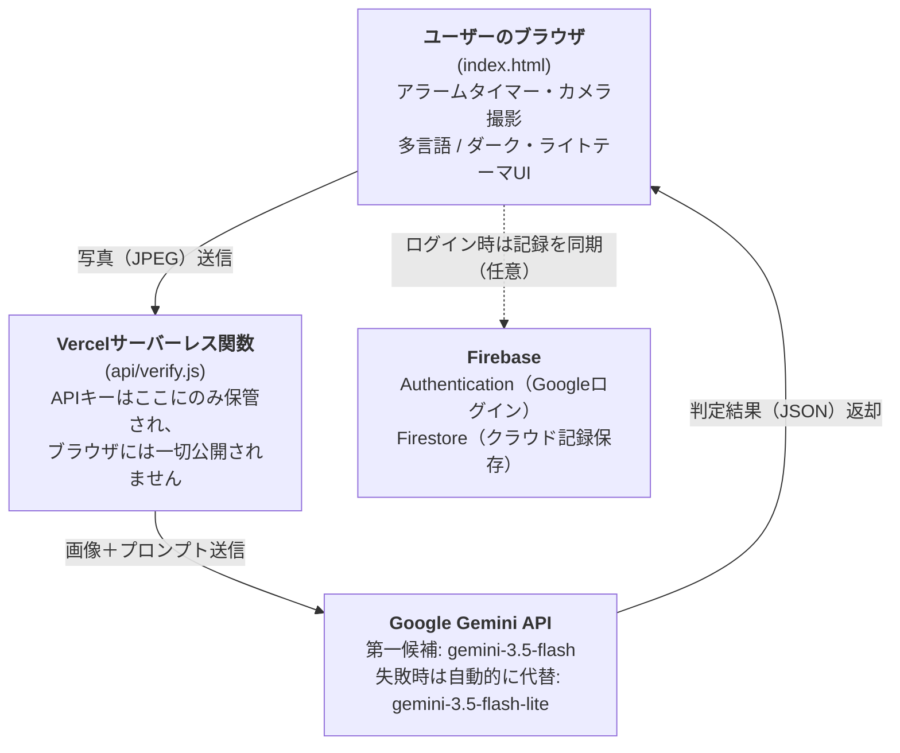

# 💧 Water-Cycle（飲水タイマープロジェクト）

**🌐 Language**: [한국어](./README.md) · [English](./README.en.md) · 日本語（本ドキュメント）


> 第4回 NAVER OGQマーケット AI Competition 出品作 · チーム **AI도 놀랄 팀（AIも驚くチーム）**
> 分野: ① IT・SW・ロボット

**🔗 ライブデモ**: https://drink-water-five-drab.vercel.app/
**🎥 3分ピッチ動画**: https://youtu.be/ApWkJ1hUQ2w

---

## プロジェクト概要

**飲水タイマープロジェクト（Water-Cycle）** は、クリーンルームなどの生産現場のように業務特性上こまめな水分補給がおろそかになりやすい環境において、一定周期ごとに作業者が自然に持ち場を離れて水分を補給し、それを**AIで認証**するよう促す、勤怠連携型の健康管理プロジェクトです。単発のキャンペーン施策ではなく、実際の作業動線と結び付いた反復可能なルーティン（Cycle）を設計することで、習慣化と認証を同時に達成することが核心です。

**Water-Cycle**という名称は、アラーム → 移動 → 摂取 → 認証へと続く一つの循環構造（Cycle）を意味し、このサイクルが繰り返されるほど習慣が積み重なることを象徴しています。

## 1. 課題定義

半導体ファブなどのクリーンルーム生産現場は、防塵服の着用やエアシャワーなど入退室手続きが煩雑なため、一般的なオフィス環境に比べて水を飲むという行為自体のハードルが高くなっています。長時間の集中作業によって喉の渇きに気づかなかったり、気づいても実行に移しにくいという構造的な問題があります。このような慢性的な水分不足は、集中力低下、疲労蓄積、労働災害リスクの増加につながるおそれがあります。

従来の単純なアラームアプリやボタンクリック型のチェックリストには、「アラームに気づいた」ことと「実際に水を飲んだ」ことの間のギャップを確認する方法がないという根本的な限界があります。**Water-Cycleは、このギャップをAI Visionで埋めます。** 決められた時間にアラームが鳴り、ユーザーが実際に水を飲む様子を撮影して初めてAIがそれを判定し、アラームを解除します。単なる通知ではなく「行動検証」によって習慣を強制することが最大の差別化ポイントです。

### 既存の動線を活かす利点
作業者がどのみち通る「退室→更衣室・休憩室」という動線に水分補給を自然に組み込むことで、余計な時間を取られるという心理的抵抗を減らし、現場での受け入れやすさを高めます。

## 2. 実際の利用シナリオ（全体サイクル）

```
①アラーム確認 → ②作業の区切り → ③エアシャワー・退室 → ④給水スポットで水分補給 → ⑤アプリでAI認証 → （次のアラームまで待機、①へ循環）
```

このうち**①と⑤（アラーム発生、AI撮影認証）**が現在アプリとして実装されている部分で、②〜④は作業者が現場で実際に行う物理的な動線です。

## 3. アーキテクチャ

ブラウザ（フロントエンド）はAI APIキーを一切知りません。撮影した写真は自社バックエンドサーバーにのみ送信され、バックエンドが環境変数に保存されたキーを使ってAI APIを代わりに呼び出します。AI判定は、主モデルが応答しない場合に備え、同一サービス内で予備モデルへ自動的に切り替わる冗長構成としており、記録の保存はログインの有無によってブラウザストレージまたはクラウドに分かれます。



- 撮影された画像は判定後直ちに破棄され、サーバーやデータベースには一切保存されません。
- **ログインしなくても全機能をそのまま利用できます。** その場合、本日の認証記録・統計・設定はブラウザストレージに保存され、ページを更新しても保持されます。
- **Googleアカウントでログインすると**、同じ記録がFirestore（クラウド）に保存され、機種変更やブラウザのデータ削除後も保持されるほか、過去14日分の記録を個別に確認できます。

## 4. 使用技術スタック

| 領域 | 技術 |
|---|---|
| フロントエンド | HTML / CSS / Vanilla JavaScript（フレームワークなし） |
| バックエンド | Vercel Serverless Functions（Node.js） |
| AIモデル | Google Gemini — `gemini-3.5-flash`（第一候補） / `gemini-3.5-flash-lite`（失敗時に自動代替） — Vision（画像理解）API |
| ログイン・クラウド保存 | Firebase Authentication（Googleログイン）、Cloud Firestore |
| デプロイ | Vercel |
| バージョン管理 | GitHub |
| 多言語対応 | 韓国語 / English / 日本語（独自実装のi18n） |

## 5. 実行方法

### すぐに体験する（推奨）
[ライブデモ](https://drink-water-five-drab.vercel.app/)にアクセス → **「⚡ 今すぐアラームテスト（デモ用）」**ボタンで待機なしに即座にアラームを体験 → カメラで水を飲む様子を撮影 → AIの判定結果を確認
（ログインなしでも全機能を体験可能です。画面右上からGoogleログインも任意でお試しいただけます。）

### ローカルで実行する
```bash
git clone <このリポジトリのURL>
cd water-cycle
npm i -g vercel
vercel dev
# 実行前に、Google AI Studio（https://aistudio.google.com/apikey）で取得した
# GEMINI_API_KEYを環境変数として登録してください。
# ログイン・クラウド保存機能を使う場合は、Firebaseプロジェクトを作成し、
# index.html内のfirebaseConfigの値をご自身のプロジェクトの値に置き換えてください。
```

### デプロイする
1. GitHubリポジトリをVercelにインポート
2. Vercelプロジェクトの Settings → Environment Variables に `GEMINI_API_KEY` を登録
3. Deployを実行
4. （任意）Firebaseコンソールで Authentication（Googleログイン）とFirestoreを有効化し、デプロイ先ドメインを「承認済みドメイン」に追加

## 6. AI活用明細

**コア機能（サービスに不可欠な構成要素）**

| 項目 | 内容 |
|---|---|
| 使用AIモデル | Google Gemini — `gemini-3.5-flash`（第一候補）、`gemini-3.5-flash-lite`（代替） |
| 活用方法 | ユーザーが撮影した写真1枚をVision（画像理解）機能で分析し、「水・飲料を飲んでいる動作かどうか」を判定。判定結果（true/false）と簡潔な理由をJSONで受け取り、アラーム解除の可否を決定 |
| 冗長化の理由 | 人気モデルの特性上、応答が一時的に遅延する場合があるため、同一サービス内のより軽量なモデルへ自動的に切り替え、サービスの安定性を高めています |
| 活用範囲 | **認証方式はAIによる写真判定のみです。** ボタンクリックやQRスキャンだけでは認証は完了せず、AI判定なしにはサービスが成立しません。 |

**開発補助ツール（企画・制作過程での活用）**

| ツール | 活用目的 |
|---|---|
| Claude（Anthropic） | コード全体の作成・デバッグ、アーキテクチャ設計、デプロイ手順の案内 |
| Gemini | アイデア出しおよび企画補助 |
| HyperCLOVA X | README等のマークダウン文書作成時の文法活用・文章表現の推敲補助 |
| ChatGPT（画像生成） | チームロゴの制作 |

## 7. 個人情報および倫理（P/Fチェックリスト）

| 点検項目 | 対応内容 |
|---|---|
| **個人情報保護** | 撮影された画像はAI判定の目的で1回だけ使用され、判定後は即座に破棄されます。サーバーやデータベースには一切保存されません。顔認識や本人確認機能はなく、「飲水行動かどうか」のみを判定します。ログイン時に保存される情報は水分摂取記録と設定値のみで、Firestoreのセキュリティルールにより本人アカウントのデータにのみアクセスできるよう制限しています。 |
| **著作権** | コード・アイコン・フォントは、自社制作またはオープンソース／無料ライセンスのリソースのみを使用しています。 |
| **AI生成物の表記** | 使用したAIモデルとその活用範囲は上記「6. AI活用明細」にて明確に公開しています。 |
| **未成年者の安全** | 本サービスは半導体ファブの成人労働者を対象に設計されており、未成年者の利用は想定していません。 |

## 8. 現在実装済みの機能

- **アラームシステム**: 設定した周期に従って単一のアラームが鳴動、本日の記録をリセットする機能
- **5分延長（スヌーズ）**: アラームが鳴ってもクリーンルームからの退室・エアシャワーなどですぐに認証できない場合、「5分延長」ボタンでアラームを一時停止し、5分後に再度鳴動するよう再設定できます。**アラーム1回につき1度のみ使用可能**で、それ以降は実際に水を飲んでAI認証を完了するまで鳴り続けます。
- **AI認証システム**: カメラ撮影 → Gemini Vision判定（第一候補失敗時は自動的に代替モデルへ切り替え）→ アラーム解除、失敗時は再撮影ボタンを表示
- **ログイン・クラウド記録保存（任意）**: Googleアカウントでログインすると記録がFirestoreに保存され、機種変更後も保持されるほか、過去14日分の記録を確認できます。ログインしなくてもブラウザストレージで同様に動作します。
- **統計**: 本日の試行・成功・失敗回数、成功率、平均認証間隔をリアルタイムに集計
- **多言語対応**: 韓国語／English／日本語の3言語をリアルタイムに切り替え可能（AIの判定理由も選択した言語で返却）
- **ダーク・ライトモード**: 画面テーマを暗い／明るいトーンに即座に切り替え
- **アクセシビリティ・安定性**: オフライン状態表示、スクリーンリーダー用ラベル、原因別エラー案内（利用上限超過／タイムアウト／サーバー混雑／ネットワークなど）を選択言語で表示

## 9. 今後の拡張アイデア

以下は未実装の項目で、8週間のコーチング期間中に発展させたいと考えている計画です。

- **二重アラーム構造**: クリーンルーム退室時間帯に合わせた2次アラームの追加
- **交代勤務パターンの自動調整**: 勤務シフトに合わせてアラーム周期を自動変更
- **QRコード入退室タギング**: クリーンルーム出入口にQRコードを設置し、退室時にスキャンすると退室時刻が自動記録され、その時刻に合わせて飲水アラームのタイミングを補正する機能（飲水認証自体は引き続きAI写真判定のみを使用し、QRは「退室時刻の把握」という補助的な役割にとどめます）
- **管理者ダッシュボード**: 部署・ライン単位の集計、認証率が低い人員へのリマインド送信、統計レポート（Excel／PDF）のダウンロード
- **データ連携分析**: 認証データと社内健康診断データの連携、季節（猛暑期）に応じたアラーム周期の自動短縮
- **可視化**: 給水スポット別の利用状況ヒートマップ

## 10. 拡張可能性 — 半導体ファブを超えて

Water-Cycleの核心原理（**「決められた時間にアラーム → 実際の行動をAIで検証」**）は半導体ファブに限定されず、**水分補給の管理が必要なあらゆる現場にそのまま応用可能**です。

| 現場 | 適用例 |
|---|---|
| 病院（手術室・集中治療室など） | 無菌服を着用し、長時間の手術で水分補給を忘れがちな医療スタッフ向け |
| 建設現場 | 夏季の猛暑下における屋外作業者の熱中症予防 |
| 物流センター・一般製造工場 | 半導体ファブ以外の生産職従事者にも同じ構造で適用可能 |
| コールセンター・オフィスワーク | 長時間座って作業し、水分補給を忘れやすい環境 |
| 介護施設 | 自ら喉の渇きを認識・訴えることが難しい高齢者向けに、介護者・保護者用の通知ツールとして応用 |
| スポーツ・フィットネス | 高強度運動中の水分補給タイミング管理 |

つまり、「AIによる写真判定で行動を検証する」という構造自体はそのままに、**アラーム周期と対象ユーザーを変えるだけで、さまざまな業界に再利用可能な汎用ソリューション**へと拡張できます。これは単一業界に限定されたニッチ製品ではなく、複数の業界にB2Bでライセンス供与したり、SaaS形態で販売したりできる**事業化の可能性**を意味します。

## 11. 多言語ローカライズ戦略

単にUI文言を3言語に翻訳するだけでなく、各言語圏のユーザー体験まで考慮しました。

- **文体のローカライズ**: 日本語は産業現場向けツールにふさわしい丁寧語のトーンで、英語は国際的なビジネス環境で通用する簡潔な案内文のトーンで、それぞれ別途作成しました。機械翻訳をそのまま貼り付けるのではなく、言語ごとに自然な文章を新たに構成しています。
- **AI判定結果の言語連動**: 写真判定後に返される「判定理由」のテキストも、ユーザーが選択した言語で直接生成されるよう、言語情報をサーバーに合わせて送信しています。UIだけが翻訳され、AIの応答は韓国語のままという中途半端な多言語対応にならないよう設計しました。
- **カスタマーサポートの多言語化**: アプリ内の「よくある質問（FAQ）」も3言語で同一内容を提供し、言語の壁なく自己解決できるようにしています。
- **技術文書の多言語化**: 本READMEを含むプロジェクト文書は[한국어](./README.md)、[English](./README.en.md)でも提供し、海外パートナーや審査員・開発者が韓国語を知らなくてもプロジェクトを理解できるようにしています。

## 12. 保守・技術サポート体制

B2Bソリューションとして実際の産業現場に導入されることを想定し、以下のような運用体制を設計・適用しています。

### デプロイ・アップデートプロセス
- コードはGitHubの`main`ブランチで管理され、コミットが反映されるとVercelが自動的に再デプロイします。
- フロントエンドは別途インストールやアプリのアップデートが不要で、ユーザーがページを更新した瞬間に最新版が適用されます。
- バックエンド（サーバーレス関数）も同じデプロイパイプラインを使用するため、フロントエンドと常に同じバージョンに保たれます。

### 障害対応プロセス
1. **モニタリング**: Vercelの関数ログとGoogle AI Studioの使用量ダッシュボードで、エラーやトラフィックをリアルタイムに確認します。
2. **原因の切り分け**: エラーをネットワーク／AIサービス障害／コード不具合に分類し、原因を絞り込みます（例：開発過程で発生した504タイムアウト、503サーバー混雑、404モデル廃止などを、それぞれ異なる方法で診断・対応しました）。
3. **修正とデプロイ**: 原因が特定でき次第、コードを修正してコミットし、自動再デプロイで即座に反映します。
4. **記録の蓄積**: 対応内容を「開発ヒストリー」（下記14番）に記録し、同様の問題が再発した際に素早く参照できるようにしています。

### 技術サポートチャネル（計画）
- **一次セルフサポート**: アプリ内の多言語FAQで、よくある問題（アラームが鳴らない、カメラエラーなど）を即座に確認可能
- **二次問い合わせチャネル**: GitHub Issuesを正式な問い合わせ・不具合報告窓口として運用予定
- **対応目標**: サービス停止級の障害は、確認後24時間以内の一次対応を目標とする（現時点ではチームプロジェクト段階の目標値であり、実際に事業化する際にはSLAとして具体化する計画です）

### 今後の計画
- デプロイ履歴を追跡できる`CHANGELOG.md`の導入
- 導入企業の担当者向けに、別途運用ガイド文書を作成

## 13. 期待される効果

- **健康面**: 定期的な水分補給による疲労軽減、集中力の維持、熱中症予防
- **安全面**: 喉の渇き・脱水による瞬間的な集中力低下を防止し、労働災害リスクを低減
- **運用面**: 既存の勤務動線を活用するため、余計な時間損失なく習慣を定着可能
- **データ面**: 認証データの蓄積による、個人別・部署別の健康管理指標としての活用可能性

## 14. 開発ヒストリー（障害対応記録）

| 段階 | 問題 | 解決 |
|---|---|---|
| 1次→2次構造への転換 | フロントエンドから直接AI APIを呼び出す構造だったため、開発プレビュー環境の外では動作しなかった | フロントエンド・バックエンド分離アーキテクチャへ全面的に再設計し、APIキーはサーバーにのみ保管 |
| AI判定の失敗 | AI応答のパース方式の問題により、実際に飲水している状況でも誤判定が発生 | JSON構造化レスポンスへ切り替え、判定基準を寛容に調整 |
| 504タイムアウト | サーバーのコールドスタート＋AI解析時間が関数の制限時間を超過 | 関数の制限時間を引き上げ、撮影画像の解像度を最適化して処理速度を改善 |
| 503サーバー混雑 | 人気モデルの特性上、Geminiサーバーが一時的に過負荷応答を返す | 主モデル失敗時に同一サービス内の代替モデルへ自動的に切り替える冗長構成を導入 |
| アラームが鳴らない・音が小さい | ブラウザの自動再生ポリシーやモバイル環境の影響で、音が再生されない、または小さすぎる | ユーザーのクリック時点で音声を事前に有効化、画面復帰時の再開ロジック、音量の引き上げ、バイブレーションの追加 |
| エラーメッセージが分かりにくい | ステータスコードがそのまま表示され、ユーザーが原因を把握しにくい | 原因別（利用上限超過／タイムアウト／サーバー混雑／ネットワーク）に、選択言語に応じた案内文を提供 |
| 記録の消失 | ブラウザストレージのみを使用していたため、機種変更やブラウザのデータ削除で記録が消えてしまう | Googleログイン＋Firestoreクラウド保存機能を追加（ログインは任意のまま維持） |

## おわりに

**Water-Cycle**は、「アラーム → 作業の区切り → 退室 → 摂取 → AI認証」という一つの完結した循環構造を通じて、クリーンルームのような特殊な勤務環境でも無理なく水分補給の習慣を定着させることを目指しています。既存の動線を最大限に活用して現場での受け入れやすさを高め、AI認証データをもとに継続的な改善が可能なシステムへと発展させていくことが、本プロジェクトの中心的な方向性です。

## ライセンス

本プロジェクトは[MIT License](./LICENSE)に基づいて公開されています。
