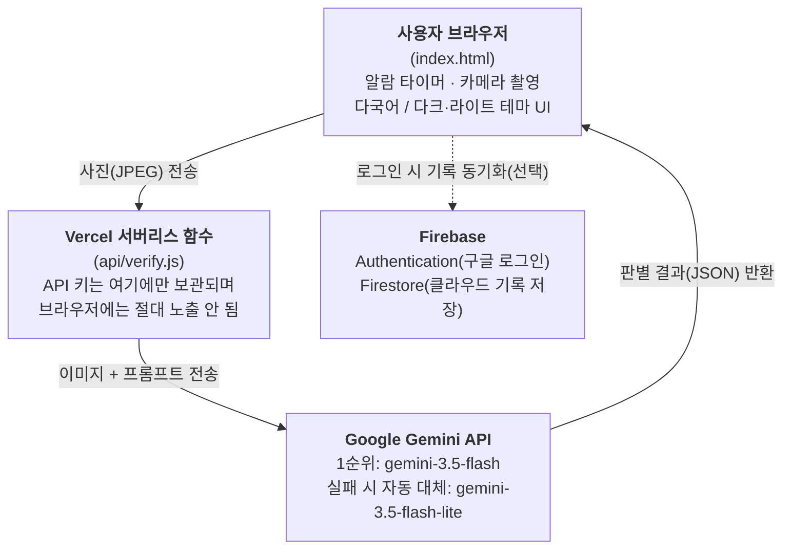

# 💧 Water-Cycle (음수 타이머 프로젝트)

**🌐 Language**: 한국어 (현재 문서) · [English](./README.en.md) · [日本語](./README.ja.md)


> 제4회 NAVER OGQ마켓 AI Competition 출품작 · 팀 **AI도 놀랄 팀**
> 분야: ① IT·SW·로봇

**🔗 라이브 데모**: https://drink-water-five-drab.vercel.app/
**🎥 3분 피치 영상**: https://youtu.be/ApWkJ1hUQ2w

---

## 프로젝트 개요

**음수 타이머 프로젝트(Water-Cycle)** 는 클린룸·생산 현장 등 근무 특성상 수분 섭취가 소홀해지기 쉬운 환경에서, 정해진 주기마다 작업자가 자연스럽게 작업장을 벗어나 수분을 섭취하고 이를 **AI로 인증**하도록 유도하는 근태 연계형 건강 관리 프로젝트입니다. 단순한 캠페인성 챌린지가 아니라, 실제 작업 동선과 결합된 반복 가능한 루틴(Cycle)을 설계하여 습관화와 인증을 동시에 달성하는 것이 핵심입니다.

**Water-Cycle**이라는 이름은 알람 → 이동 → 섭취 → 인증으로 이어지는 하나의 순환 구조(Cycle)를 의미하며, 이 사이클이 반복될수록 습관이 축적됨을 상징합니다.

## 1. 문제 정의

저희 팀은 충남반도체마이스터고등학교 재학생으로 구성되어 있어, 처음에는 저희에게 가장 익숙한 반도체 팹 클린룸 근무 환경을 문제 상황으로 떠올렸습니다. 반도체 팹은 방진복 착용, 에어샤워 등 출입 절차가 까다로워 일반 사무 환경보다 물 마시는 행위 자체의 진입 장벽이 높고, 장시간 집중 작업으로 갈증을 인지하지 못하거나 인지해도 실행에 옮기기 어려운 구조적 문제가 있습니다.

그런데 반도체 산업 전시회 현장에서 진행한 실제 사용자 인터뷰(6건)를 통해 두 가지를 새롭게 확인했습니다. 첫째, **방진복을 입지 않는 일반 산업 근로자들도 "물 마실 시간이 없거나 귀찮아서 잘 안 마시게 된다"는 동일한 문제를 겪고 있었습니다.** 둘째, 반도체 팹 클린룸은 카메라 반입 자체가 금지되어 있고 방진복 장갑 때문에 터치 조작도 어려워, 오히려 저희가 처음 구상했던 "AI 사진 인증" 방식은 정작 반도체 현장에서 적용하기 어렵다는 현실적인 제약도 함께 발견했습니다.

이에 따라 저희는 문제의 범위를 반도체 산업에 한정하지 않고, **수분 섭취 타이밍을 스스로 챙기기 어려운 산업 현장 근로자 전반**으로 넓혔습니다. 카메라 사용에 제약이 없는 일반 제조·물류·서비스 현장에서는 AI 사진 인증 방식을 그대로 적용하고, 카메라 반입이 제한되는 반도체 클린룸 같은 특수 환경에 대한 대응은 향후 확장 과제(9번 섹션 참고)로 별도로 다루기로 했습니다.

이로 인한 만성적인 수분 부족은 집중력 저하, 피로 누적, 안전사고 위험 증가로 이어질 수 있습니다.

기존의 단순 알람 앱이나 버튼 클릭형 체크리스트는 "알람을 인지했다"와 "실제로 물을 마셨다" 사이의 간극을 확인할 방법이 없다는 근본적인 한계가 있습니다. **Water-Cycle은 이 간극을 AI Vision으로 메웁니다.** 정해진 시간에 알람이 울리고, 사용자가 실제로 물을 마시는 모습을 촬영해야만 AI가 이를 판별해 알람을 해제합니다. 단순 알림이 아니라 "행동 검증"을 통해 습관을 강제하는 것이 핵심 차별점입니다.

### 기존 동선 활용의 이점
작업자가 어차피 거쳐야 하는 "퇴실 → 휴게 공간" 동선에 수분 섭취를 자연스럽게 결합시켜, 추가적인 시간 낭비에 대한 심리적 저항을 줄이고 현장 수용성을 확보합니다.

## 2. 실제 사용 시나리오 (전체 사이클)

```
① 알람 확인 → ② 작업 마무리 → ③ 작업 구역 퇴실 → ④ 음수대에서 수분 섭취 → ⑤ 앱에서 AI 인증 → (다음 알람까지 대기, ①로 순환)
```

이 중 **①과 ⑤ 단계(알람 발생, AI 촬영 인증)** 가 현재 앱으로 구현되어 있으며, ②~④는 작업자가 실제 현장에서 수행하는 물리적 동선입니다.

## 3. 아키텍처

브라우저(프론트엔드)는 AI API 키를 전혀 알지 못합니다. 촬영한 사진을 자체 백엔드 서버로만 전송하고, 백엔드가 환경변수에 저장된 키로 AI API를 대신 호출합니다. AI 판별은 주 모델이 응답하지 않을 경우를 대비해 같은 서비스 안에서 대체 모델로 자동 전환되도록 이중화했고, 기록 저장은 로그인 여부에 따라 브라우저 저장소 또는 클라우드로 나뉩니다.



- 촬영된 이미지는 판별 즉시 폐기되며, 서버나 데이터베이스 어디에도 저장되지 않습니다.
- **로그인하지 않아도 모든 기능을 그대로 사용할 수 있습니다.** 이 경우 오늘의 인증 기록·통계·설정은 브라우저 저장소에 보관되어 새로고침해도 유지됩니다.
- **Google 계정으로 로그인하면** 같은 기록이 Firestore(클라우드)에 저장되어, 기기를 바꾸거나 브라우저를 지워도 유지되고 지난 14일 기록을 별도로 조회할 수 있습니다.

## 4. 사용 스택

| 영역 | 기술 |
|---|---|
| 프론트엔드 | HTML / CSS / Vanilla JavaScript (프레임워크 없음) |
| 백엔드 | Vercel Serverless Functions (Node.js) |
| AI 모델 | Google Gemini — `gemini-3.5-flash`(1순위) / `gemini-3.5-flash-lite`(실패 시 자동 대체) — Vision(이미지 이해) API |
| 로그인 · 클라우드 저장 | Firebase Authentication(Google 로그인), Cloud Firestore |
| 배포 | Vercel |
| 버전관리 | GitHub |
| 다국어 | 한국어 / English / 日本語 (자체 구현 i18n) |

## 5. 실행 방법

### 바로 체험하기 (권장)
[라이브 데모](https://drink-water-five-drab.vercel.app/) 접속 → **"⚡ 지금 알람 테스트 (심사용)"** 버튼으로 대기 없이 즉시 알람 체험 → 카메라로 물 마시는 모습 촬영 → AI 판별 결과 확인
(로그인 없이도 전체 기능 체험 가능하며, 우측 상단에서 Google 로그인도 선택적으로 테스트할 수 있습니다.)

### 로컬에서 실행하기
```bash
git clone <이 저장소 URL>
cd water-cycle
npm i -g vercel
vercel dev
# 실행 전 Google AI Studio(https://aistudio.google.com/apikey)에서 발급받은
# GEMINI_API_KEY를 환경변수로 등록해야 합니다.
# 로그인/클라우드 저장 기능을 쓰려면 Firebase 프로젝트를 생성하고
# index.html의 firebaseConfig 값을 본인 프로젝트 값으로 교체해야 합니다.
```

### 배포하기
1. GitHub 저장소를 Vercel에 Import
2. Vercel 프로젝트 Settings → Environment Variables에 `GEMINI_API_KEY` 등록
3. Deploy
4. (선택) Firebase 콘솔에서 Authentication(Google 로그인)과 Firestore를 활성화하고, 배포된 도메인을 "승인된 도메인"에 추가

## 6. AI 활용 명세

**핵심 기능(서비스의 필수 구성요소)**

| 항목 | 내용 |
|---|---|
| 사용 AI 모델 | Google Gemini — `gemini-3.5-flash`(1순위), `gemini-3.5-flash-lite`(대체) |
| 활용 방식 | 사용자가 촬영한 사진 1장을 Vision(이미지 이해) 기능으로 분석해 "물/음료를 마시는 동작인지" 판별. 판별 결과(true/false)와 짧은 이유를 JSON으로 반환받아 알람 해제 여부를 결정 |
| 이중화 이유 | 인기 모델 특성상 일시적으로 응답이 지연되는 경우, 같은 서비스 안의 더 가벼운 모델로 자동 전환해 서비스 안정성을 높였습니다 |
| 활용 범위 | **인증 방식은 AI 사진 판별이 유일합니다.** 버튼 클릭이나 QR 스캔만으로는 인증이 완료되지 않으며, AI 판별 없이는 서비스가 성립하지 않습니다. |

**개발 보조 도구 (기획·제작 과정에서 활용)**

| 도구 | 활용 목적 |
|---|---|
| Claude (Anthropic) | 전체 코드 작성 및 디버깅, 아키텍처 설계, 배포 방법 안내 |
| Gemini | 아이디어 구상 및 기획 보조 |
| HyperCLOVA X | README 등 마크다운 문서 작성 시 문법 활용 및 문장 표현을 다듬는 작문 보조 |
| ChatGPT (이미지 생성) | 팀 로고 제작 |

## 7. 개인정보 및 윤리 (P/F 체크리스트)

| 점검 항목 | 대응 내용 |
|---|---|
| **개인정보 보호** | 촬영된 이미지는 AI 판별 목적으로 1회 전송 후 즉시 폐기되며, 서버·데이터베이스 어디에도 저장되지 않습니다. 얼굴 인식이나 신원 식별 기능은 없고, "음수 행동 여부"만 판별합니다. 로그인 시 저장되는 정보는 수분 섭취 기록과 설정값뿐이며, Firestore 보안 규칙으로 본인 계정 데이터만 접근 가능하도록 제한했습니다. |
| **저작권** | 코드·아이콘·폰트는 자체 제작 또는 오픈소스/무료 라이선스 리소스만 사용했습니다. |
| **AI 생성물 표기** | 사용된 AI 모델과 활용 범위를 "6. AI 활용 명세"에 명확히 공개했습니다. |
| **미성년자 안전** | 본 서비스는 산업 현장 성인 근로자를 대상으로 설계되었으며, 미성년자 이용을 전제하지 않습니다. |

## 8. 현재 구현된 기능

- **알람 시스템**: 설정한 주기에 따라 단일 알람 발생, 오늘 기록 초기화 기능
- **5분 연기(스누즈)**: 알람이 울려도 위험 작업 중이거나 이동 중이라 즉시 인증이 어려운 경우, "5분 연기" 버튼으로 알람을 잠시 끄고 5분 뒤 다시 울리도록 재설정. **알람 1회당 단 한 번만 허용**되며, 이후 다시 울리면 실제로 물을 마셔 AI 인증을 완료할 때까지 계속 울립니다.
- **AI 인증 시스템**: 카메라 촬영 → Gemini Vision 판별(1순위 실패 시 대체 모델 자동 전환) → 알람 해제, 실패 시 재촬영 버튼 제공
- **로그인 · 클라우드 기록 저장(선택)**: Google 계정으로 로그인하면 기록이 Firestore에 저장되어 기기가 바뀌어도 유지되며, 지난 14일 기록을 조회할 수 있습니다. 로그인하지 않아도 브라우저 저장소로 동일하게 작동합니다.
- **통계**: 오늘의 시도/성공/실패 횟수, 성공률, 평균 인증 간격 실시간 집계
- **다국어**: 한국어 / English / 日本語 3개 언어 실시간 전환 (AI 판별 이유도 선택 언어로 반환)
- **다크/라이트 모드**: 화면 테마를 어두운/밝은 톤으로 즉시 전환
- **접근성/안정성**: 오프라인 상태 표시, 스크린리더용 레이블, 원인별 오류 안내(한도초과/시간초과/서버혼잡/네트워크 등)

## 9. 향후 확장 아이디어

아래 항목은 아직 구현되지 않은, 8주 코칭 기간 중 발전시키고자 하는 계획입니다.

- **이중 알람 구조**: 작업 구역 퇴실 시간대에 맞춘 2차 알람 추가
- **교대(시프트) 패턴 자동 조정**: 근무 교대에 맞춰 알람 주기 자동 변경
- **QR 코드 출입 태깅**: 사업장 출입구에 QR 코드를 부착해, 근로자가 퇴실할 때 QR을 스캔하면 퇴실 시각이 자동 기록되고 이 시각에 맞춰 음수 알람 타이밍을 보정하는 기능 (음수 인증 자체는 지금처럼 AI 사진 판별을 그대로 유지하고, QR은 "퇴실 시점 파악"이라는 보조 역할)
- **카메라 반입 제한 현장 대응**: 반도체 팹 클린룸처럼 보안상 카메라 반입 자체가 금지되거나, 방진복 장갑 때문에 터치 조작이 어려운 특수 환경을 위해, 음수대에 유량 센서를 부착하거나 사원증 태그로 인증하는 대체 방식 검토 (반도체 산업 전시회 현장 인터뷰에서 실제로 확인된 제약사항에 대한 대응)
- **관리자 대시보드**: 부서/라인 단위 집계, 인증률 저조 인원 리마인드 발송, 통계 리포트(엑셀/PDF) 다운로드
- **데이터 연계 분석**: 인증 데이터와 사내 건강검진 데이터 연계, 계절별(폭염기) 알람 주기 자동 단축
- **시각화**: 음수대 위치별 이용 현황 히트맵

## 10. 적용 산업 사례

Water-Cycle의 핵심 원리(**"정해진 시간에 알람 → 실제 행동을 AI로 검증"**)는 특정 산업에 국한되지 않고, **수분 섭취 관리가 필요한 다양한 현장에 그대로 적용 가능**합니다.

| 현장 | 적용 예시 |
|---|---|
| 반도체 팹 클린룸 | 방진복 착용 근로자 대상. 단, 카메라 반입이 금지된 구역은 9번 섹션의 대체 인증 방식(센서·사원증 태그) 적용 필요 |
| 병원 (수술실·중환자실 등) | 무균복 착용, 장시간 수술로 수분 섭취를 놓치기 쉬운 의료진 대상 |
| 건설 현장 | 여름철 폭염 속 옥외 작업자의 온열질환 예방 |
| 물류센터·일반 제조 공장 | 다양한 생산직 근로자에게 동일 구조로 적용 |
| 콜센터·사무직 | 장시간 앉아서 근무하며 수분 섭취를 잊기 쉬운 환경 |
| 요양시설 | 스스로 갈증을 인지·표현하기 어려운 고령자의 보호자·요양보호사용 알림 도구로 응용 |
| 스포츠·피트니스 | 고강도 운동 중 수분 보충 타이밍 관리 |

즉 "AI 사진 판별로 행동을 검증한다"는 구조 자체를 그대로 두고, **알람 주기와 타겟 사용자만 바꾸면 다양한 산업에 재사용 가능한 범용 솔루션**으로 확장할 수 있습니다. 이는 단일 산업에 국한된 니치 제품이 아니라, B2B로 여러 산업군에 라이선싱하거나 SaaS 형태로 판매할 수 있는 **사업화 가능성**을 의미합니다.

## 11. 다국어 현지화 전략

단순히 UI 문구를 3개 언어로 번역하는 것을 넘어, 각 언어권 사용자 경험까지 고려했습니다.

- **문체 현지화**: 일본어는 산업 현장용 도구에 맞는 정중한 존댓말(丁寧語) 톤으로, 영어는 국제 업무 환경에서 통용되는 간결한 안내문 톤으로 별도 작성했습니다. 기계 번역을 그대로 붙여넣지 않고 언어별로 자연스러운 문장을 새로 구성했습니다.
- **AI 판별 결과의 언어 연동**: 사진 판별 후 반환되는 "판별 이유" 텍스트도 사용자가 선택한 언어로 직접 생성되도록 서버에 언어 정보를 함께 전달합니다. UI만 번역되고 AI 응답은 한국어로만 나오는 반쪽짜리 다국어가 되지 않도록 설계했습니다.
- **고객지원의 다국어화**: 앱 내 "자주 묻는 질문(FAQ)" 역시 3개 언어로 동일하게 제공하여, 언어 장벽 없이 스스로 문제를 해결할 수 있도록 했습니다.
- **기술 문서의 다국어화**: 이 README를 포함한 프로젝트 문서를 [English](./README.en.md), [日本語](./README.ja.md)로도 제공하여, 해외 파트너나 심사위원·개발자가 한국어를 몰라도 프로젝트를 이해할 수 있도록 했습니다.

## 12. 유지보수 및 기술 지원 체계

B2B 솔루션으로서 실제 산업 현장에 배포될 것을 가정해, 아래와 같은 운영 체계를 설계·적용하고 있습니다.

### 배포·업데이트 프로세스
- 코드는 GitHub `main` 브랜치를 통해 관리되며, 커밋이 반영되면 Vercel이 자동으로 재배포합니다.
- 프론트엔드는 별도 설치나 앱 업데이트 없이, 사용자가 페이지를 새로고침하는 즉시 최신 버전이 적용됩니다.
- 백엔드(서버리스 함수)도 동일한 배포 파이프라인을 사용해 프론트엔드와 항상 같은 버전으로 유지됩니다.

### 이슈 대응 프로세스
1. **모니터링**: Vercel 함수 로그와 Google AI Studio 사용량 대시보드로 오류·트래픽을 실시간 확인합니다.
2. **원인 분류**: 오류를 네트워크/AI 서비스 장애/코드 결함으로 구분해 원인을 좁힙니다. (예: 이번 개발 과정에서 504 타임아웃, 503 서버 혼잡, 404 모델 단종 등을 이 방식으로 각각 다르게 진단하고 대응했습니다.)
3. **패치 및 재배포**: 원인이 확인되면 코드를 수정해 커밋하고, 자동 재배포로 즉시 반영합니다.
4. **기록**: 대응 과정을 "개발 히스토리"(아래 14번 섹션)에 남겨, 같은 문제가 재발했을 때 빠르게 참고할 수 있도록 합니다.

### 기술 지원 채널 (계획)
- **1차 셀프 지원**: 앱 내 다국어 FAQ로 자주 발생하는 문제(알람 무음, 카메라 오류 등)를 즉시 확인 가능
- **2차 문의 채널**: GitHub Issues를 공식 문의·버그 제보 창구로 운영 예정
- **대응 목표**: 서비스 중단급 오류는 확인 후 24시간 내 1차 대응을 목표로 함 (현재는 팀 프로젝트 단계의 목표치이며, 실제 사업화 시 SLA로 구체화할 계획)

### 향후 계획
- 배포 이력을 추적할 수 있는 `CHANGELOG.md` 도입
- 도입 기업 담당자용 별도 운영 가이드 문서 작성

## 13. 기대 효과

- **건강 측면**: 정기적인 수분 섭취를 통한 피로도 감소, 집중력 유지, 온열질환 예방
- **안전 측면**: 갈증·탈수로 인한 순간적 집중력 저하 방지, 산업 안전사고 위험 감소
- **운영 측면**: 기존 근무 동선을 활용해 별도의 시간 손실 없이 습관 정착 가능
- **데이터 측면**: 인증 데이터 축적을 통한 개인별/부서별 건강 관리 지표 활용 가능성

## 14. 개발 히스토리 (이슈 대응 기록)

| 단계 | 문제 | 해결 |
|---|---|---|
| 1차 → 2차 구조 전환 | 프론트엔드에서 AI API를 직접 호출하는 구조라 배포 환경 밖에서 작동 불가 | 프론트엔드-백엔드 분리 아키텍처로 전면 개편, API 키를 서버에만 보관 |
| AI 판별 실패 | AI 응답 파싱 방식 문제로 실제 음수 상황도 오탐 발생 | JSON 구조화 응답으로 전환, 판정 기준을 관대하게 조정 |
| 504 타임아웃 | 서버 콜드스타트 + AI 분석 시간이 함수 제한시간을 초과 | 함수 제한시간 상향, 촬영 이미지 해상도 최적화로 처리 속도 개선 |
| 503 서버 혼잡 | 인기 모델 특성상 Gemini 서버가 일시적으로 과부하 응답 | 주 모델 실패 시 같은 서비스 내 대체 모델로 자동 전환하는 이중화 구조 도입 |
| 알람 무음/약함 | 브라우저 자동재생 정책 및 모바일 환경에서 소리가 재생되지 않거나 작음 | 사용자 클릭 시점 오디오 사전 활성화, 화면 전환 시 재개 로직, 볼륨 상향, 진동 추가 |
| 오류 메시지 혼란 | 상태 코드가 그대로 노출되어 사용자가 원인을 알기 어려움 | 원인별(한도초과/시간초과/서버혼잡/네트워크)로 선택 언어에 맞는 안내 문구 제공 |
| 기록 소실 | 브라우저 저장소만 사용해 기기 변경·브라우저 삭제 시 기록이 사라짐 | Google 로그인 + Firestore 클라우드 저장 기능 추가 (로그인은 선택 사항으로 유지) |
| 타겟 범위 재정의 | 반도체 산업 전시회 현장 인터뷰(6건) 결과, 정작 반도체 팹 클린룸은 카메라 반입 자체가 금지되어 있고 방진복 장갑 때문에 터치 조작도 어려워 AI 사진 인증 방식을 적용하기 어렵다는 사실을 확인. 반면 방진복을 입지 않는 일반 산업 근로자도 동일한 수분 부족 문제를 겪고 있음을 확인 | 서비스 대상을 반도체 산업 한정에서 카메라 사용 제약이 없는 산업 현장 전반으로 확장. 카메라 반입이 금지된 특수 환경(반도체 클린룸 등)에 대한 대응은 별도 향후 과제로 분리 |

## 마무리

**Water-Cycle**은 "알람 → 마무리 → 퇴실 → 섭취 → AI 인증"이라는 하나의 완결된 순환 구조를 통해, 다양한 산업 현장에서도 무리 없이 수분 섭취 습관을 정착시키는 것을 목표로 합니다. 기존 동선을 최대한 활용해 현장 수용성을 높이고, AI 인증 데이터를 기반으로 지속적인 개선이 가능한 시스템으로 발전시켜 나가는 것이 프로젝트의 핵심 방향입니다.

## 라이선스

이 프로젝트는 [MIT License](./LICENSE)를 따릅니다.
